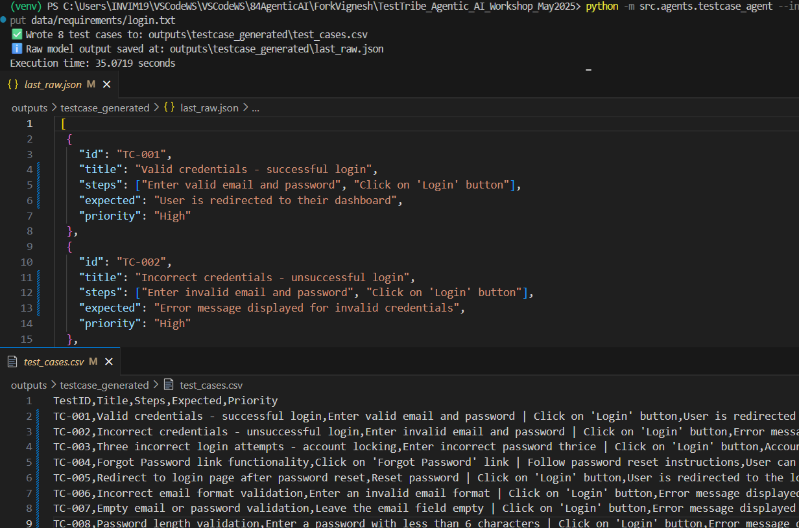
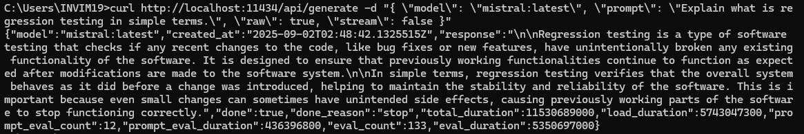

# Agentic AI – Hands-On

## Day 1 Activities
- Discussed **Cloud vs Local models**
- Called the **Ollama API** using `curl`
- Called the **OpenAI API** using `curl`
- Created the framework from scratch
- Successfully ran the `agents.testcase_agent`

## Prerequisites
Before running the agent, set up the environment:

```bash
python -m venv venv
pip install -r requirements.txt
python -m src.agents.testcase_agent --input data/requirements/login.txt
```

## Output


## CMD-compatible curl command to test Ollama

```
curl http://localhost:11434/api/generate -d "{ \"model\": \"mistral:latest\", \"prompt\": \"Explain what is regression testing in simple terms.\", \"raw\": true, \"stream\": false }"
```
