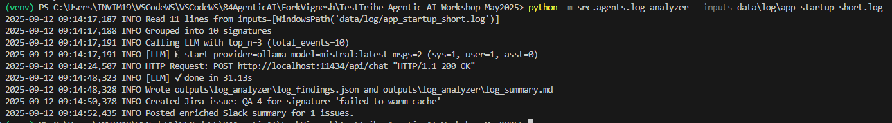

# Agentic AI – Hands-On

<details>
<summary>📅 Day 1</summary>

## ✅ Day 1 Activities
- Discussed **Cloud vs Local models**
- Called the **Ollama API** using `curl`
- Called the **OpenAI API** using `curl`
- Created the framework from scratch
- Successfully ran the `agents.testcase_agent`

## 💡 Prerequisites
Before running the agent, set up the environment:

```bash
python -m venv venv
pip install -r requirements.txt
python -m src.agents.testcase_agent --input data/requirements/login.txt
```

##  🚀  Output


## CMD-compatible curl command to test Ollama

```
curl http://localhost:11434/api/generate -d "{ \"model\": \"mistral:latest\", \"prompt\": \"Explain what is regression testing in simple terms.\", \"raw\": true, \"stream\": false }"
```


### Assignment for edgecase_agent is completed


</details>

---

<details>
<summary>📅 Day 2</summary>

### ✅ Key Learnings
- Log Analyzer AI Agent


### 🚀 Hands-on
```
python -m src.agents.log_analyzer --inputs data/log/app_startup_short.log
```


### 💡 Notes
- 

</details>

---

<details>
<summary>📅 Day 3</summary>

### ✅ Key Learnings
- Log Analyzer AI Agent with Logging
- Learned how to parse and normalize raw log files into structured events.
- Understood grouping of log messages using computed signatures for better analysis.
- Explored integrating LLM to summarize logs and extract probable root causes.
- Implemented error-rate calculation and post-processing of LLM findings.

### 🚀 Hands-on
- Implemented log parsing:
  - Extracted timestamp, log level, and message from each line.
  - Normalized messages into short signatures by stripping paths, numbers, and punctuation.
- Grouped events:
  - Aggregated log entries by signature.
  - Counted occurrences and tracked log levels (INFO, WARN, ERROR).
  - Collected example lines for context.
- Built LLM workflow:
  - Constructed system + user prompts with grouped log data.
  - Enriched groups with extracted exceptions (e.g., `NullPointerException`).
  - Called the LLM to generate structured findings.
- Post-processed results:
  - Validated and corrected total events and error rate.
  - Filled missing probable root causes with extracted exception tokens.
  - Generated JSON findings and a Markdown summary report.

### 💡 Notes
- Using signatures instead of raw messages helps consolidate duplicate or similar log patterns.
- Providing examples and extracted exception tokens improves LLM accuracy.
- Post-processing ensures resilience against invalid or incomplete LLM outputs.
- Output artifacts (`log_findings.json`, `log_summary.md`) can be reused in pipelines or dashboards.

### 🚀 Command & Screenshot
- 


- 

</details>

---
<details>
<summary>📅 Day 4</summary>

### ✅ Key Learnings
- Understood how to integrate TestCase results with TestRail.
- Learned how to automate log analysis workflows with Jira and Slack.
- Explored handling duplicates and grouping logic when creating issues.

### 🚀 Hands-on
- Integrated TestCase creation with TestRail:
  - Mapped LLM output to TestRail payload.
  - Retrieved and normalized test cases from TestRail.
  - Skipped duplicate cases.
  - Successfully created test cases in TestRail.
- Integrated LogAnalyser with Jira and Slack:
  - Generated log summary reports using LLM.
  - Extracted error groups and created one Jira issue per group.
  - Implemented logic to check if an issue already exists for today before creating new ones.
  - Posted summarized findings to Slack channels.

### 💡 Notes
- Maintaining normalization and duplication checks avoids unnecessary noise in TestRail.
- Grouping log errors before creating Jira issues ensures better tracking and avoids duplicates.
- Slack integration helps with real-time visibility of test and log analysis updates.

### 🚀 Command & Screenshot
- Integrated TestCase creation with TestRail:

```
python -m src.agents.testcase_agent --input data/requirements/signup.txt
```


- Integrated LogAnalyser with Jira and Slack:

```
python -m src.agents.log_analyzer --inputs data\log\app_startup_short.log
```



</details>

---

<details>
<summary>📅 Day 5</summary>

### ✅ Key Learnings
- 

### 🚀 Hands-on
- 


### 💡 Notes
- 

</details>
